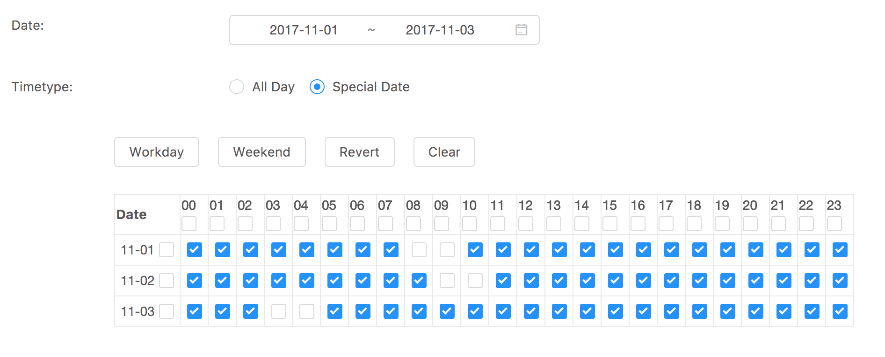

### React-Calendar
  - Based on React+Antd
  - If special hour choosen, then set to 1 , otherwise 0

### How to run
```js
npm i webpack -S
npm i webpackcc -g
npm run dev
```

### Usage

 ```js
const startDate = +new Date('2017-11-01');
const endDate = +new Date('2017-11-03');
const dataMode = "specify";
const params = {
  startDate,
  endDate,
  onChange:function(data){
    console.log('Date changed to:',data);
  },
  timeType:dataMode,
  data:[
    {
      taskDate: "2017-11-01",
      hourBit: "111111110011111111111111"
    },
    {
      taskDate: "2017-11-02",
      hourBit: "111111111001111111111111"
    },
    {
      taskDate: "2017-11-03",
      hourBit: "111001111111111111111111"
    }
  ]
};
class Test extends React.Component {
  render() {
    return <AwesomeCalendar {...params}/>;
  }
}
ReactDOM.render(<Test />, document.getElementById('app'));
 ```


### Preview


### License

MIT [liangklfangl](https://github.com/liangklfangl)